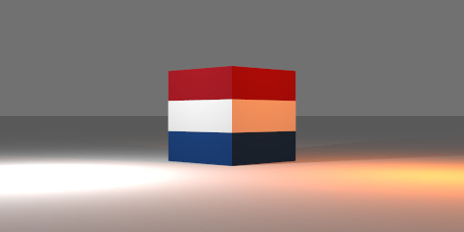

# Gamma and the sRGB Keywords in POV-Ray 3.7: a Tutorial

## The Issue

What is gamma, why should assumed_gamma be set to 1, and how should we use the sRGB keywords introduced with POV-Ray 3.7?

In the real world, a 1,600 lumen lamp emits twice as much light as an 800 lumen lamp, and a 40% gray object reflects half as much light as an 80% gray object. To render this reality, POV-Ray must use linear color. Setting `global_settings { assumed_gamma 1 }` accomplishes this goal, and has been the recommended setting since POV-Ray 3.7.

The problem is that our perceptions are non-linear, and our monitors and software often reflect that non-linearity. Gamma is the measure of this non-linearity. Typically, RGB colors are specified with the non-linear sRGB standard, so in order for them to look correct with assumed_gamma 1, they must be decoded to a linear format. This is what the sRGB series of keywords (`srgb`, `srgbf`, `srgbt`, and `srgbft`) does.1

In addition, many scene files written prior to POV-Ray 3.7 failed to specify an assumed_gamma, so the resulting image defaulted to whatever gamma was used by the computer—usually 2.2, which is similar to sRGB. When rendered with POV-Ray 3.7, these scenes look pale and washed out. The quick fix is to specify `global_settings { assumed_gamma 2.2 }`, but if you wish to put in the work to make the scene physically realistic, the new keywords can help.

However, confusion often arises over the use of these keywords.

## How to Use the sRGB Keywords

The first thing to remember is that POV-Ray has **one** and only **one** color format. The `srgb` keyword does not create a different kind of color than the `rgb` keyword; it simply interprets its argument differently. When you `#declare` a color, the resulting variable has no memory of which keyword was used to declare it.

The second thing to remember is that the keywords in the sRGB series decode from sRGB to linear, not the other way around!

It is also important to remember that the entire expression following the keyword is evaluated before the conversion is applied; and that the standard sRGB function is defined for the domain 0...1.

Here is the general sequence for usage of these keywords:

1. Set `global_settings { assumed_gamma 1 }` *before* using any of the keywords.

2. An sRGB triplet that comes from a color picker, eyedropper tool, or published Web source is typically in the range <0,0,0> ... <255,255,255>. These are byte triplets. However, POV-Ray does not use byte triplets; these must be divided by 255 to bring them into the range <0,0,0> ... <1,1,1>. This *must* be done first thing, and is the *only* math that should ever be done at this stage, though it may be combined with step 3. If the color is specified in percentages, of course you would divide by 100 instead of 255.

3. `#declare` (or `#local`) the color with the `srgb` keyword. The resulting identifier contains a linear color. *If and only if* no additional math is required, you may skip the `#declare`/`#local` and use the `srgb` directly in a pigment or light_source.

4. Now, do whatever additional math you need on the identifier. You may do this in a pigment or light_source or wherever.

If your color is from `colors.inc`, then you *must* skip step 2, because these colors are already within <0,0,0> ... <1,1,1>. For these colors, you should use the `srgbft` keyword in step 3, because they are already declared with filter and transmit components.

If your color comes from function `eval_pigment()`, you must skip steps 2 *and* 3. Such colors are already within POV-Ray’s working space, and starting with POV-Ray 3.7, this includes image maps.

## Examples

Example 1: the Dutch flag. Steps 2 & 3 are combined. Since no additional math is required on the colors, there is no need to declare them as identifiers.

    pigment
    { gradient y color_map
      { [1/3 srgb <32, 71, 133> / 255] // Steps 2 & 3
        [1/3 White]
        [2/3 White]
        [2/3 srgb <170, 28, 38> / 255] // Steps 2 & 3
      }
    }

Example 2: an orange light. Since this example doesn’t use a byte triplet, step 2 is unnecessary.

    #declare C = srgb <1, 0.5, 0>; // This must be declared separately! (step 3)
    #declare Ld = 100; // light distance
    #declare Fd = 1; // fade distance
    light_source
    { <100, 50, 0>,
      C * (1 + pow (Ld/Fd, 2)) / 2 // Step 4: math is applied to identifier C
      fade_power 2
      fade_distance Fd
    }

## Epilogue

Linear color applies only to the tracing phase. The output command line options `Display_Gamma` and `File_Gamma` should remain at their default `sRGB` setting. The `gamma` option for image maps should normally be left unspecified.

## Resources

- [John Novak’s Blog](https://blog.johnnovak.net/2016/09/21/what-every-coder-should-know-about-gamma/): important background information
- [POV-Ray Gamma Tutorial](https://wiki.povray.org/content/Documentation:Tutorial_Section_3.3#Gamma_Handling)
- [CLipka’s comments](https://news.povray.org/5862ea88%241%40news.povray.org)
- [Strange problem with srgb color in light_source](https://news.povray.org/povray.general/thread/%3C6064e968%241%40news.povray.org%3E/): an extensive newgroup discussion

---

1 Technically, these keywords convert an sRGB-specified color to match whatever assumed_gamma you are using. Using `assumed_gamma 1` means they will convert to linear.

---

Copyright © 2022, 2024 Richard Callwood III.  Some rights reserved, under a [Creative Commons Attribution-ShareAlike 4.0 International license](https://creativecommons.org/licenses/by-sa/4.0/).
